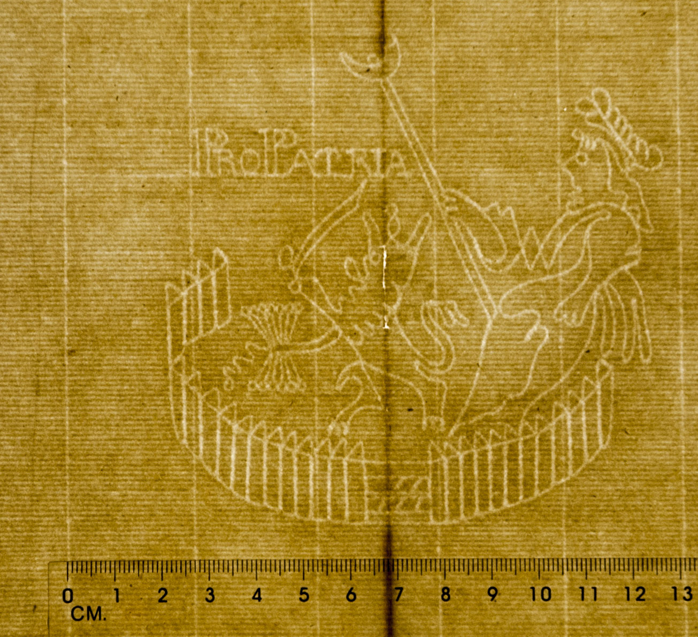

## The Uses of Metadata

Prior to the revelations of [Edward Snowden](https://en.wikipedia.org/wiki/Edward_snowden)'s leaking of classified information regarding [NSA](https://en.wikipedia.org/wiki/National_Security_Agency) monitoring of US citizens’ private communications, the word “metadata” was little-known or understood to people other than IT professionals, programmers, and the odd scholars engaged in [information interchange](http://www.tei-c.org/index.xml).

But metadata is everywhere. In the old [index files](https://commons.wikimedia.org/wiki/File:Archiv.jpg) of libraries, the under-appreciated and oft-neglected front matter in published books, the “Product Details” section of an Amazon.com item, and even in the images we take using our digital cameras. Most of us are familiar with the metadata stored in index files of libraries, but a majority of people would be surprised at the wealth of information digital images contain, too. Information from the type of camera used to snap the photo to geolocation information pinpointing where the image was created might well be embedded in the images we share online every day.

<figure>
    
    <figcaption>"[The Phase of Moon](https://commons.wikimedia.org/wiki/File:The_phase_of_Moon.jpg)", photo by [阿爾特斯](https://zh.wikipedia.org/wiki/User:%E9%98%BF%E7%88%BE%E7%89%B9%E6%96%AF). Hosted by Wikimedia Commons.</figcaption>
</figure>

By using an online metadata extractor, you can see [the metadata embedded in this photo](http://regex.info/exif.cgi?imgurl=https%3A%2F%2Fupload.wikimedia.org%2Fwikipedia%2Fcommons%2F9%2F99%2FThe_phase_of_Moon.jpg) and any other photo taken with a modern digital camera. For instance, this image hosted on the Wikimedia website contains a wealth of information that you cannot see until the image is processed through a metadata extractor of some type.

So, metadata is everywhere, and it can be useful for helping us to think about, organize, and understand the documents and other assets that are a part of our everyday work with literature and literary interpretation. Librarians and other information specialists know the incredible value of [Dublin Core Metadata](http://wiki.dublincore.org/index.php/User_Guide) as a means for describing electronic assets. Dublin Core is a metadata standard used to help identify digital assets stored in various online repositories, and is the default metadata standard for the [Omeka publishing platform](http://omeka.org/).

The [Digital Public Library of America](http://dp.la/) (DPLA) has its own [in-house metadata standard](http://dp.la/info/wp-content/uploads/2013/04/DPLAMetadataPolicy.pdf) designed to be compatible with other common standards, such as the Dublin Core. In fact, the DPLA policy is to share the metadata associated with its digital assets freely. So, though the current trend in the news media is to shroud the term “metadata” in mystery and associations with secret, hidden information, the fact is that metadata is a tool that can be openly produced and shared among scholars in digital environments toward the goal of collaborative scholarship and knowledge production.

## Metadata and Close Reading

Metadata is used for many purposes, but its primary purpose for most scholars is to describe and assist in organizing and *interpreting* information. As Lou Burnard put it, it is “[data about data](http://users.ox.ac.uk/%7Elou/wip/metadata.html).” But someone has to do the work of attributing the data to the data, and in a system like the TEI, it is usually an individual or a team of encoders who must do this work by hand. Computers can read and manipulate metadata, and embedded systems can automatically generate metadata prescribed by engineers, but computerized systems [cannot accurately produce meaningful metadata](http://www.salon.com/2010/09/09/google_books/) for [newly digitized documents](http://chronicle.com/article/Googles-Book-Search-A/48245/). This means that the human encoders must become expert close readers of their documents, adding and attributing data about their subject with an expert eye and keen interpretive skill.

The act of encoding a document using XML, just like the practice of transcription and documentary editing, is an act of interpretation bounded by certain [agreed-upon constraints](http://www.tei-c.org/release/doc/tei-p5-doc/en/html/USE.html#CF) defined by an international scholarly community of TEI experts and users of the standard. However, the individual editor/encoder of a document may engage in encoding with greater or lesser detail, depending on their needs and interests.1

In the case of digitizing and encoding the known works of the 18th-century American poet and slave, Jupiter Hammon, my goal was to do a basic markup of his works, mainly using the [TEI-Lite tagset](http://www.tei-c.org/Guidelines/Customization/Lite/), with a few additional tags I thought would be useful for the project. My graduate students and I would use original digital copies of Hammon’s works collected during the course of the fall semester of 2011 as our copy-texts.

The project went smoothly, and we were able to collect all of Hammon’s known works, do original transcriptions of those works, and then mark them up into TEI XML documents. The whole process took the entire semester, but the close attention to detail and my later editing of the transcriptions and TEI encoding made me particularly sensitive to the content of Hammon’s body of works. I was already well acquainted with Hammon’s writings from years of reading, teaching, and writing about him, but the exercise of closely editing his poems and essays from digitized originals was nevertheless enlightening, leading me to notice details that would be very useful later.

## A Unique Discovery

In the process of collecting these digital images to use as our copy-text, we came across a document attributed to Jupiter Hammon at Yale University’s Sterling Library.

A full account of the discovery can be read in my recent joint article with Julie McCown published in *[Early American Literature](http://muse.jhu.edu/login?type=summary&url=/journals/early_american_literature/v048/48.2.may.html)*. But here is where the real fun begins.

![Poem written in cursive on old parchment reading: "Our forefathers came from Africa tost over the raging main to a Christian shore there for to stay and not return again. Dark and dismal was the Day when slavery began all humble thoughts were put away then slaves were made by Man. When God doth please for to permit that slavery should be it is our duty to submit till Christ shall make us free. Come let us join with one consent with humble hearts and say for every sin we must repent and walk in wisdom’s way. If we are free we’ll pray to God if we are slaves the same it’s firmly fixt in his [holy] word ye shall not pray in vain. Come blessed Jesus in thy Love and hear thy children cry and send them smiles now from above and grant them Liberty. Tis thou alone can make us free we are thy subjects too pray give us grace to bend a knee the time we stay below. Tis unto thee we look for all thou art our only King thou hast the power to save the soul and bring us flocking in. We come as sinners unto thee we know thou hast the word come blessed Jesus make us free and bring us to our God. Although we are in Slavery we will pray unto our God he hath mercy beyond the sky tis in his holy word. Come unto me ye humble souls although you live in strife I keep alive and save the soul and give eternal life. To all that do repent of sin be they bond or free I am their saviour and their king they must come unto me. Hear the words now of the Lord the call is loud and certain we must be judged by his word without respect of person. Come let us seek his precepts now and love his holy word with humble soul we’ll surely bow and wait the great reward. Although we came from Africa we look unto our God to help our hearts to sigh and pray and Love his holy word. Although we are in slavery bound by the yoke of Man we must always have a single eye and do the best we can. Come let us join with humble voice now on the christian shore if we will have our only choice tis slavery no more. Now let us not repine and say his wheels are slow he can fill our hearts with things divine and give us freedom too. He hath the power all in his hand and all he doth is right and if we are tide [sic] to the yoke of man we’ll pray with all might. This the state of thousands now who are on the christian shore forget the Lord to whom we bow and think of him no more. When shall we hear the joyful sound echo the christian shore each humble voice with songs resound that slavery is no more. Then shall we rejoice and sing loud praises to our God come sweet Jesus heavenly king the art the son Our Lord. We are thy children blessed Lord tho still in slavery we’ll seek thy precepts Love thy word until the day we Die. Come blessed Jesus hear us now and teach our hearts to pray and seek the Lord to whom we bow before tribunal day. Now glory be unto our God all praise be justly given come seek his precepts love his works that is the way to Heaven."](jupiter-hammon-poem.jpg "Digital image of a newly-discovered poem written by Jupiter Hammon in 1787.")

When we requested information about the manuscript in Yale’s possession, the online finding aid did not have a title for the poem, just that there was a manuscript of a poem in their Hillhouse Family Papers collection. An archivist at Yale libraries emailed my graduate student the partial title of the poem they had in their possession; no one knew the title would turn out to be something totally unknown. The assumption was that Yale had a *copy* of a printing of an already-known poem by Hammon. It wasn’t until I looked at the email and saw that the poem was titled “An Essay on Slavery” that I thought to myself that there are no known poems of this name by Jupiter Hammon. Upon further inquiry, we eventually received an email with the full title and the first two stanzas of the poem.2 I recognized right away that two of the eight lines in the alleged Hammon poem were close paraphrases of lines reproduced from a 1778 poem, “An Address to Miss Phillis Wheatley.” I could also see that the meter, rhythm, and vocabulary of the stanzas appeared similar to what I was familiar with in other Hammon poems and prose works.

I knew then that my main task was the process of authenticating the document in Yale’s possession as genuinely Jupiter Hammon’s. So, after receiving a digital scan, I began doing those things that are a part of the process. As Kline and Holbrook state in [*A Guide to Documentary Editing, 3rd Edition*](http://gde.upress.virginia.edu/index.html), “The process of authenticating documents by handwriting, signatures, and literary style begins now. To these methods of identification the editor should add a sense of logic and historical context, assigning dates or authors to undated or unsigned materials” ([Kline and Holbrook 76](http://gde.upress.virginia.edu/02-gde.html#h2.2)). It was my work in assigning and editing metadata that helped me to accomplish these tasks by exposing me to the appropriate documents, transcriptions, and historical contexts that are a necessary part of both authentication and accurate metadata encoding.

Think of it this way: it’s one thing to closely read and reread a document, having conversations about it with students and colleagues along the way. It is another thing to labor over the significance of each and *every mark* (even those that *appear* to be stray ones) on a manuscript or holograph page in order to decide on the proper metadata encoding to attribute to it–and then argue the merits of your choices with other reader-encoders. Such closeness to a text requires a deep engagement with interpretation and memorization that is important to the discipline of literary scholarship.

In some ways, it was the somewhat long and laborious effort to find physical documents to transcribe and encode that led to this discovery. But it was also the *work* of transcribing and encoding those documents with metadata by hand with a [plain-text editor](http://chronicle.com/blogs/profhacker/writing-power-tools-text-editors) that later aided in the authentication of the work. For instance, I knew from examining the original extant copies of Hammon’s works that there is only one document that we know of that has an example of his handwriting on it, and my team of transcribers had been working with a digital copy of it. The essay, “A Winter Piece,” located at the [Connecticut Historical Society Museum &amp; Library](http://www.chs.org/), and published in 1782, has an autograph on the title page, with what was presumed to be Jupiter Hammon’s handwriting. There is no mention of this autograph in any of the collections of Hammon’s writings. It wasn’t until I actually received a digital copy of the 1782 edition from the Connecticut Historical Society that I realized there was an extant example of Hammon’s handwriting. This turned out to be a fortuitous discovery, as “An Essay on Slavery” is a four-page [holograph](https://en.wikipedia.org/wiki/Holograph), and upon comparing the two documents on my computer screen, the handwriting matched perfectly.

## Tradeoffs: What We Gain &amp; Lose in Digitization

> “Even more basically, an editor can never assume that a document is authentic because it comes from a well-known repository: at even the oldest and best-known libraries, there are dark archival corners that have never been reviewed carefully by modern curators” ([Kline and Holbrook 76](http://gde.upress.virginia.edu/02-gde.html#h2.2)).

What my students and I gained in digitizing and encoding the known works of Jupiter Hammon *far* exceeded expectations. We gained a much deeper knowledge of Hammon’s poetry and prose by scrutinizing original, published manuscripts and assigning markup to our transcriptions. We found and debated the meaning of extra-textual markings, such as hand-written annotations, signatures, missing and obscured letters, and holes in the pages to the meaning in the text and encoded our ideas as part of our TEI markup. Unexpectedly, the project contributed to the discovery of a completely unknown handwritten manuscript by our author. There are many more benefits to the transcription and encoding of digital documents that I could name, but it was the close reading and interpretation skills that made the lessons of the exercise so useful and even thrilling.

The “Maid of Dort” form of a [Pro Patria watermark](http://www.gravell.org/Record.php?&action=GET&RECID=2274&offset=5&rectotal=23&query=SELECT%20DISTINCT%20*%20FROM%20records%20WHERE%20MATCH%20%28S_DESC%29%20AGAINST%20%28%27%2B%5C%22maid%20of%20dort%5C%22%27%20IN%20BOOLEAN%20MODE%29%20ORDER%20BY%20YEAROFUSE) located on one half of the paper on which Jupiter Hammon’s “An Essay on Slavery” is written. This Watermark cannot be seen on a regular scanned image of the page. This image is a photograph taken while resting the manuscript page on a [light table](https://en.wikipedia.org/wiki/Light_table) to make the watermark visible to the naked eye. But there are always tradeoffs to using one technology over another. While digital technologies have made it much easier to collect and work with manuscripts without having to physically be in the archive, there are still some dark corners of the digital world that require personal contact with materials. Just as it is not yet possible for computers to make meaning or generate consistently accurate metadata from scanned manuscripts, it is also difficult to see some of the details of a manuscript page on a given scan, no matter how high the resolution.

For instance, the scan of “An Essay on Slavery” Yale delivered to me was of invaluable use due largely to its very high quality and resolution, but the scanning technology used to create the digital image could not “see” or reproduce important details of the holograph page. Two important features of the page useful for authentication were the watermark and countermark that required the use of a [light table](https://en.wikipedia.org/wiki/Light_table) to see. This “information” in the form of watermarks was as important to dating and authentication the poem as Hammon’s writing style and handwriting. The make of the paper (laid), and the measurements of the laid lines were also important, as they helped me to establish (as Kline and Holbrook direct) the manuscript’s context. That is, they helped me figure out not only when the poem was written, but *where*. Also, being in the physical archive helped me to make numerous comparisons and data collection across hundreds of documents from several collections within the holdings at Yale libraries, which would have been impossible remotely. However, in the end, it was that one line of text in an email, received while looking for digital copies of *known* works that led to an original discovery. And that original discovery, made as part of a digital humanities project, is contributing to a thorough reevaluation of Jupiter Hammon’s works, particularly as they relate to [the way he wrote about the institution of slavery](http://www.yalealumnimagazine.com/articles/3662?page=1).3 All of the new context, information, and interpretation will further inform the metadata that will eventually encode all of the digital transcriptions and TEI documents that are currently being edited into my digital edition of Hammon’s expanded body of known works.

In other words, not only have the results of this project to digitize Jupiter Hammon’s works led to the interpretation of individual documents but also to the reevaluation of his life’s work and his significance as an historical figure.

The TEI encoding of metadata in the Jupiter Hammon project will not be of the sort hidden within digital images and NSA files. Rather, it will be the open and openly shared data that will hopefully contribute to further enriching what we know about this important author and the world in which he lived. Perhaps the data we already have, or even the lapses within it, will point researchers toward the other lost writings that are known to have been written during Jupiter Hammon’s lifetime.

---

## Footnotes

1. Of course, many of the users of the TEI also engage in vigorous, daily debate about the composition and best methods for using the markup standard. A look at the archive for the TEI mailing list will reveal some of [the most active scholarly deliberations](http://tei-l.970651.n3.nabble.com/) about metadata, meaning and interpretation to be found anywhere.

2. Since the discovery of the Jupiter Hammon poem has been made public, Yale libraries has updated the finding aid and corrected the metadata in their own systems, listing the poem’s name along with its author and moving the holograph manuscript to its own box. See the finding aid, “[Guide to the Hillhouse Family Papers, MS 282](http://drs.library.yale.edu:8083/HLTransformer/HLTransServlet?stylename=yul.ead2002.xhtml.xsl&pid=mssa:ms.0282&query=hillhouse%20family&clear-stylesheet-cache=yes&hlon=yes&big=&adv=&filter=&hitPageStart=1&sortFields=&view=all#ref244).”

3. I should take a moment here to point out that Jupiter Hammon has had an unfortunate reputation among some scholars and other readers of his works because of certain statements he made about his condition as a slave in his final published work, [“An Address to the Negroes in the State of New York”](http://digitalcommons.unl.edu/etas/12/) (1787). Certain passages in the essay have been misconstrued in such a way as to make Hammon seem like an apologist for slavery, as someone with no strong feelings against the institution. However, this is a longstanding error that this new poem, “An Essay on Slavery” definitively corrects.