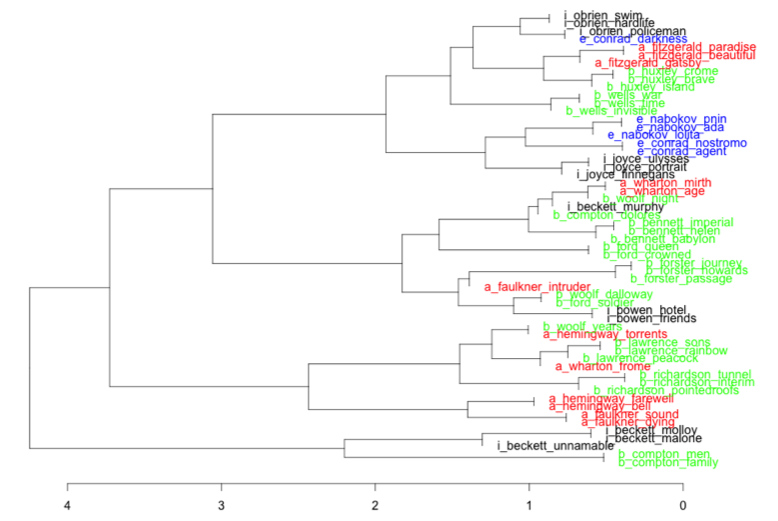

Computational stylistics offers a variety of methodologies through which authorial signatures might be explored and used for analysis within literary criticism. This MLA ‘14 paper will use computational methods to reproblematise the stylometric elements of national modernisms, with a specific focus on Western, first-generation English works. A corpus of modernist novels from across the American, British, Irish and wider European canons has been selected, and analysed using a variety of computational techniques. It is hoped that the results of this study will further contribute to ongoing debates on the regional division of modernist literature.In the introduction to their aptly entitled *Geomodernisms*, Doyle and Winkiel note that modernist interpretations depend on “*which* modernism … which city, which hillside”, revealing “diverse modernisms formed against and through each other, proximate or distant, and constituted by their locations in the world” (1). What is yet to be revealed, however, is the extent to which spatial influences have been reflected across modernist *stylistics*. Friedman argues that as the significance of boundaries with cultural studies continues to recede, there has been an increased tendency for scholars to read modernism “on a planetary scale” (500). Recognising the need to facilitate both intra- and interdisciplinary collaboration if such a holistic approach to criticism is to be adopted, Friedman represents a transnationalist discourse which, while perhaps not yet dominant, is undoubtedly prominent among literary scholars. Critics have long delineated what Berman labels as “the geographical impulses of modernist writing” (282), but, as already noted, there is a lack of direct engagement with style. Modernisms are frequently defined as being spatiotemporally conceived, yet it is worthwhile exploring the extent to which the modernisms of place equate to any authorial signatures which might emerge as being geographically distinct. Modernist literature is characteristically borne of its environment; of interest here is whether or not such topologies can be traced throughout the relevant stylistics. When one speaks of American or Irish literary modernisms, do distinct stylometric patterns emerge? Using computational methods, this paper seeks to address this issue. Computational stylistics, or stylometry, is the process of applying computational approaches to assist in the distant reading of style, so that traditional approaches to critical arguments might be supplemented with quantitative evidence. Hoover defines such approaches to literature as representing “elements or characteristics of literary texts numerically, applying the powerful, accurate, and widely accepted methods of mathematics to measurement, classification, and analysis”, noting the importance for these methodologies to be tempered by more established practices (“Quantitative Analysis and Literary Studies”). While this approach to criticism is indeed based on statistical models and quantitative methodologies, “computational literary criticism is insufficiently scientific” (Ramsey), requiring sufficient literary contextualisation and interpretation, generally validated through close reading, if findings are to be legitimate. In his recent book, Jockers defends the use of macroanalytical approaches in literary criticism, offering a tentative description of these approaches as being “designed for probing” literature (32). Computers can probe large corpora at a far more efficient rate than any individual or team of scholars, but while a machine merely *counts*, critics *read*. Thus, in keeping with the spirit of this panel, this opportunity will be used to outline my approach, while my literary findings and interpretations will be reserved for the forthcoming gathering of readers in Chicago.

Primarily, the “Stylo” package for *R* (Eder, Kestemont, and Rybicki) is used to conduct several multivariate stylometric analyses of the following dataset:

Beckett, Samuel  
*Murphy* (1938)  
*Molloy* (1955)  
*Malone Dies* (1956)  
*The Unnamable* (1958)

Bennett, Arnold  
*The Grand Babylon Hotel* (1902)  
*Helen with the High Hand* (1910)  
*Imperial Palace* (1930)

Bowen, Elizabeth  
*The Hotel* (1927)  
*Friends and Relations* (1931)

Compton-Burnett, Ivy  
*Dolores* (1911)  
*Men and Wives* (1931)  
*A Family and a Fortune* (1939)

Conrad, Joseph  
*Heart of Darkness* (1899)  
*Nostromo* (1904)  
*The Secret Agent* (1907)

Faulkner, William  
*The Sound and the Fury* (1929)  
*As I Lay Dying* (1930)  
*Intruder in the Dust* (1948)

Fitzgerald, F. Scott  
*This Side of Paradise* (1920)  
*The Beautiful and the Damned* (1922)  
*The Great Gatsby* (1925)

Ford, Ford Madox  
*The Fifth Queen Crowned* (1908)  
*The Good Soldier* (1915)  
*The Fifth Queen and How She Came to Court* (1906)

Forster, E. M.  
*The Longest Journey* (1907)  
*Howards End* (1910)  
*A Passage to India* (1924)

Hemingway, Ernest  
*The Torrents of Spring* (1926)  
*A Farwell to Arms* (1929)  
*For Whom the Bell Tolls* (1940)

Huxley, Aldous  
*Crome Yellow* (1921)  
*Brave New World* (1932)  
*Island* (1962)

Joyce, James  
*A Portrait of the Artist as a Young Man* (1916)  
*Ulysses* (1922)  
*Finnegan’s Wake* (1939)

Lawrence, D. H.  
*The White Peacock* (1911)  
*Sons and Lovers* (1913)  
*The Rainbow* (1915)

Nabokov, Vladimir  
*Lolita* (1955)  
*Pnin* (1957)  
*Ada or Ardor: A Family Chronicle* (1969)

O’Brien, Flann  
*At Swim-Two-Birds* (1939)  
*The Hard Life: An Exegesis of Squalor* (1962)  
*The Third Policeman* (1968)

Richardson, Dorothy  
*Pointed Roofs* (1915)  
*The Tunnel* (1919)  
*Interim* (1920)

Wells, H. G.  
*The Time Machine* (1895)  
*The Invisible Man* (1897)  
*The War of the Worlds* (1898)

Wharton, Edith  
*The House of Mirth* (1905)  
*Ethan Frome* (1911)  
*The Age of Innocence* (1920)

Woolf, Virginia  
*Night and Day* (1919)  
*Mrs. Dalloway* (1925)  
*The Years* (1937)

The dataset is intended to be a selection of authors, from the relevant canons, heavily associated with literary modernism throughout its “height”, and thereafter. For the purposes of this analysis, authors are classified as being either “American”, “British”, “Irish” or “European”, but these assignments are merely a reflection of the nationality with which they are typically aligned. Authorial signatures are formed based on the 100 most frequent words in each text. Initial insights are provided through a cluster analysis (see Fig. 1), before a more robust representation of similarities across stylistic fingerprints is presented using a bootstrap consensus tree (see Fig. 2). Clustering via the consensus tree is conducted using Burrows’ Delta (Burrows), over maximum frequency words ranging from 100 to 1000, in intervals of 100. Proximity is presented using a consensus strength of 0.5. Using most frequent words as determinants of style, as well as the suitability of Burrows’ Delta to English-language literary macroanalysis, is an established and validated approach to literary criticism (Hoover; Burrows; Rybicki and Eder).

The results of both analyses indicate that no overarching similarities exist between modernist styles when classified by region. However, as will be discussed at the MLA conference, there are particular instances within these results where clusterings warrant further appreciation. This is particularly the case with Irish modernists, which are further examined in isolation, using Gephi to assist in the visualisation of consensus tree results (see Fig. 3).

Using Zeta, which counts how many words from each segment in one corpus do not appear in a corresponding dataset (Craig and Kinney), I identify those words typical of the style of each author. These words are then factored into a further cluster analysis, once more using Delta as the measure of distance, giving more robust results (see Fig. 4). There is a distinct correlation between the style adopted by Flann O’Brien and his countryman, James Joyce, in particular texts. Of course, O’Brien is considered foremost among the Joycean disciples. Theses findings demonstrate that this approach has much to contribute to this topic, and so further analyses have been conducted in collaboration with Jan Rybicki and Katarzyna Bazarnik, Jagiellonian University, Krakow, and Maciej Eder, Pedagogical University of Krakow.

Remaining with the primary results (see Fig. 1; Fig. 2), interpretations to be offered and discussed in Chicago will focus on the notion of style across national modernisms. It would appear that, stylistically at least, a transnational discourse is applicable to this literary movement, though some exceptions do exist. In particular, I will argue that, in relation to style, we can now conclude that we do not read Beckett, but rather, read *Becketts*, and that Joyce is very much an Irish writer, who may see himself as “part of a European modernist literature” (Lernout 106), but writes in a style in-keeping with that of his compatriots. The national centrality of modernist icons like Joyce and Faulkner does not typically extend to stylistic influence, but there are exceptions of geographical note. Generally, however, my findings support the consensus argument that modernism’s pre-occupation with place transcends style – modernist authors use their literature to treat places, but not necessarily in a style that is determined by such spaces.

---

## Works Cited

Berman, Jessica. “Modernism’s Possible Geographies.” *Geomodernisms*. Ed. Laura Doyle and Laura Winkiel. Bloomington: Indiana University Press, 2005. Print.

Burrows, John. “‘Delta’: A Measure of Stylistic Difference and a Guide to Likely Authorship.” *Literary and Linguistic Computing* 17.3 (2002): 267–287. Print.

Craig, Hugh, and Arthur F. Kinney, eds. *Shakespeare, Computers, and the Mystery of Authorship*. Cambridge: Cambridge University Press, 2012. Print.

Doyle, Laura, and Laura Winkiel. “Introduction: The Global Horizons of Modernism.” *Geomodernisms*. Ed. Laura Doyle and Laura Winkiel. Bloomington: Indiana University Press, 2005. Print.

Eder, Maciej, Mike Kestemont, and Jan Rybicki. “Stylometry with R: A Suite of Tools.” *Digital Humanities 2013: Conference Abstracts*. University of Nebraska–Lincoln: N. p., 2013. 487–489. Print.

Hoover, David L. “Frequent Word Sequences and Statistical Stylistics.” *Literary and Linguistic Computing* 17.2 (2002): 157–180. Print.  
—. “Quantitative Analysis and Literary Studies.” *A Companion to Digital Literary Studies*. Ed. Susan Schreibman and Ray Siemens. Oxford: Blackwell Publishing, 2008. Blackwell Companions to Literature and Culture.  
—. “Testing Burrows’s Delta.” *Literary and Linguistic Computing* 19.4 (2004): 453–475. Print.

Jockers, Matthew L. *Macroanalysis: Digital Methods &amp; Literary History*. Urbana: University of Illinois Press, 2013. Print.

Lernout, Geert. ‘European Joyce’. *A Companion to James Joyce*. Ed. Richard Brown. West Sussex: John Wiley &amp; Sons, 2011. 93–107. Print.

Ramsey, Stephen. “Algorithmic Criticism.” *A Companion to Digital Literary Studies*. Ed. Susan Schreibman and Ray Siemens. Oxford: Blackwell Publishing, 2008.

Rybicki, Jan, and Maciej Eder. “Deeper Delta across Genres and Languages: Do We Really Need the Most Frequent Words?” *Literary and Linguistic Computing* 26.3 (2011): 315–321. Print.

Stanford Friedman, Susan. “World Modernisms, World Literature, and Comparativity.” *The Oxford Handbook of Global Modernisms*. Ed. Mark Wollaeger and Matt Eatough. Oxford: Oxford University Press, 2012. 499–525. Print.

## Acknowledgements

With thanks to Orla Murphy and Graham Allen, School of English, University College Cork, as well as Jan Rybicki (Jagiellonian University, Krakow), Maciej Eder (Pedagogical University of Krakow) and Katarzyna Bazarnik (Jagiellonian University, Krakow).