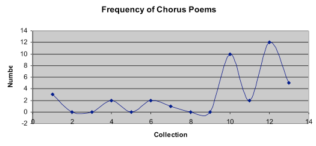

## Origin Story

This project originated in a coincidence that occurred sometime in or around 2006, when I was a graduate student at Penn State. I was binge-reading Hegel’s *Phenomenology of Spirit* at night while methodically proceeding through Yeats’s entire oeuvre during the daylight hours. Somewhere around the *Phenomenology*’s self-consciousness section and the soothsaying lunar charts of *A Vision*, it struck me that Yeats used dialectical forms to dramatize the gradual emergence of the self-conscious poet-craftsman—quite as much as Jean Hyppolite claims of Hegel’s *bildungsroman* of consciousness.

No doubt under the influence of the psychedelic *Vision*, as I stared at the Contents page of *The Collected Poems of W. B. Yeats*, it was if I’d snipped precisely the right thread and the progress of poems seemed to disaggregate in front of me. I was left with a pile of dialectical pairs—self and anti-self, self and soul, Owen Aherne and Michael Robartes, Hic and Ille—given speech in poems structured like dialogues. Take “Ego Dominus Tuus,” for example, a dialogue between Hic and Ille: when Ille intones, “By the help of an image / I call to my own opposite,” Hic responds, “And I would find myself and not an image.” In this exchange, Yeats introduces the artist—the one who deals in images—into the Hegelian profession from the abstract to the negative and thence into the concrete.

So far, so good. But at this point, connecting Yeats and Hegel was little more than a hunch. How could I know this connection was not a mere coincidence, or if the inspiration came less from the material itself than from the canny opportunism of a graduate student writing three seminar papers in early December? Combing through Yeats’s letters, I could trace his introduction to the dialectic through Nietzsche and then watch him reading and facing Hegel himself in his late 1920s *The Tower* period. That gave me a firmer foundation, but nothing that would let me add something new to accounts of Yeats’s dialecticism by other scholars.

Besides, tangled in metaphysical minutiae, I knew I was no philosopher; I am literary critic and am generally embarrassed by those trained in literature attempting philosophy *qua* philosophy. Nonplussed by the accounts of Yeats and philosophy that hardly considered the *literariness* of the texts, I wanted to bring it back to form, style, aesthetics—back, in other words, to my wheelhouse.

In addition, I wanted, if possible, to avoid the formulaic U-Pick method of tossing a theoretical concept and a literary text into a blender, and I knew I was squarely in the danger zone. So I went back to the poems, specifically those poems in which Yeats staged conversations, as it was in them that Yeats achieved the conceptual clarity and profundity that was, paradoxically, lacking in the overtly philosophical *A Vision*. The dialogue poems have been addressed before (Balachandra Rajan, David Richman, Malati Ramratnam, M. L. Rosenthal), but I was frustrated by the lack of specificity and organization in the existing criticism: Where was the definitional work, the careful parsing of “dialogue” and “dialectic?” Where was the appreciation of the dialogues as a genre with unique qualities, not a bastardization of form or wistful placeholder for the plays he “really” wanted to write?

I quickly encountered (one of) the barriers to definitional work: the sheer number and variety of dialogue poems that Yeats had written. The solution that the above scholars had turned to was to focus on the examples that used playscript indentation to make it typographically unmistakeable. Taking up my copy of the *Collected Poems* with a highlighter, I attempted to identify each dialogue poem with precision, with accuracy, with rational principles, expecting to a end up with a nice, neat couple dozen poems to work with.

Beginning with my foundational criterion—neither a lyric poem nor a dramatic monologue, a dialogue must record a conversation by *transcribing* rather than *paraphrasing* its dialogue, a difference typically indicated by typographical tells like quotation marks, italics, colons, or space breaks—I doggedly combed the volume. There was one. Another, another, another. Maybe. No. Yes. Maybe. I think so? No. Kind of? A little bit. Yes. No. If you didn’t count the first verse. Yes, yes, no, yes. Only that one part. Only if you squinted. So that was why no one had done “sufficient” definitional work.

## Methods

What could I do to organize the frustratingly large corpus, to satisfy my need to feel certain, amid all the reading and rereading, that there was, indeed, a *there* there? What could I do other than flip manically through my *Collected Poems*, hoping to light on the perfect poem? Categorization was the answer.

To the infinite amusement of my co-seminarians in Janet Lyon’s Yeats course, I showed up at draft day with a chart:

<figure>
    1. **Self-quoting** — Speaker quotes self
    2. **Hypothetical** — Speaker quotes impossible speaker
    3. **3rd Person** — Speaker acts as 3rd person narrator
    4. **1st Person** — Speaker acts as 1st person narrator
    5. **Juxtaposed** — Bare quotes without narrative infrastructure
    6. **Dramatic** — Set up like a play with speaker labels
    7. **Choral** — Uses refrains or choruses 
    1. **Simple** — No other quotation system involved
    2. **Framed-quote** — Chorus is a 3rd person narrated quotation
    3. **Narration** — Chorus is narrative infrastructure for verses
    4. **Dramatic** — Verses are 3rd person narrated quotations
    5. **Experimental** — Miscellaneous structures used only once
    8. **Imperative** — Speaker quotes what he tells someone to say
    9. **Combination** — Combines multiple quotation strategies
    10. **Incidental** — Quotations not integral to poetic structure
    <figcaption>A Typology of Yeats’s Dialogue Poems</figcaption>
</figure>

To claim any level of rationality—though we do not have to reach total objectivity with DH, we should commit to fumbling towards it, carefully collecting exceptions and absurdities for footnotes—I knew I had to devote a generous chunk of time to devising my categories. As I always (following Cheryl Glenn’s *Making Sense*) tell my composition students, categories must be consistent, exclusive, and complete:

- **Consistent**: You must use the same principle of distinction to create each category.
- **Exclusive**: Each object cannot fit more than one category.
- **Complete**: Every object under consideration must qualify into a category.

I began naming categories according to the *source* of the quoted material, so that each category indicates the relationship between the poem’s speaker and the other interlocutor quoted by that speaker.

Devising the categories with respect to completeness, exclusivity, and consistency took about the same amount of time it would take me to write ten pages of manuscript. I spent that time anxiously, beset by the clock ticking without anything to “show” for it—for I had assumed that *this* would be the easy stage, whereas the writing would be difficult. Nonetheless, despite all my hand-wringing, the resulting system was not completely consistent: only first six of ten categories share the same principle of categorization (consistency).

When I veered off into a different kind of organization principle, it was in order to ensure completeness and exclusivity (the other two criteria). More importantly, though, the process of compromising itself forced me to think critically about the definition, affordances, and development of Yeats’s dialogue poems. Each “problem” represented an interesting authorial choice; each deviation revealed a curious traits of each category of dialogue poem. In its imperfections my categorization process produced ideas and theses, pushing my thinking further well before the stage I had thought would be the “interpretive” one. But merely interacting with the texts to create data points was probably the most productive move in the entire process.

Having to alter my categorization scheme reflected changes in the way Yeats styled dialogue poems. Each decision to slot a poem into a category—or to fashion a new category for it—required me to reflect on the speakerly qualities of poetry, on what constitutes a quotation, on how Yeats uses different types of speakers to create tone, even to the extent that a poem’s dialogue style suggests its philosophical orientation and its subject. Of course, my distinctions are not entirely elegant or intuitive, but each exception explains something about Yeats’s creative process. Given the overwhelming number of poems I was dealing with, I would not have perceived these nuances and changes had I not experienced so much trouble creating the categories.

Now that I had my categories, how could I use them? In 2006, I did not really feel connected to what I thought the digital humanities were—I was under the impression it was solely a modified New Media Studies—much less have any familiarity with its tools and software. Instead, relying somewhat on rusty skills vaguely recalled from undergraduate statistics, but mostly on trial-and-error, I produced a compact array of charts and graphs visualizing the changing proportions of dialogue poems versus total poems over Yeats’s career, as well as the changing proportions of which type of dialogue poem Yeats preferred in each collection of poems. These statistics also helped to pair each category of poem with a particular research question.

Again to the infinite amusement of my co-seminarians, I showed up at the due date with, in what may be perhaps the lowest-fi DH project imaginable, a paper supplemented with Excel files. Here are some of the most suggestive:

<figure>
    <table>
        <thead>
            <tr>
                <th>Dialogue Type</th>
                <th>Total #</th>
                <th>% All Poems</th>
                <th>% Among Dialogues</th>
            </tr>
        </thead>
        <tbody>
            <tr>
                <td>Self-quoting</td>
                <td>5</td>
                <td>1.3</td>
                <td>4.9</td>
            </tr>
            <tr>
                <td>Hypothetical</td>
                <td>7</td>
                <td>1.9</td>
                <td>6.9</td>
            </tr>
            <tr>
                <td>3rd Person</td>
                <td>17</td>
                <td>4.5</td>
                <td>16.7</td>
            </tr>
            <tr>
                <td>1st Person</td>
                <td>12</td>
                <td>3.2</td>
                <td>11.8</td>
            </tr>
            <tr>
                <td>Juxtaposed</td>
                <td>4</td>
                <td>1.1</td>
                <td>3.9</td>
            </tr>
            <tr>
                <td>Dramatic</td>
                <td>13</td>
                <td>3.5</td>
                <td>12.7</td>
            </tr>
            <tr>
                <td>Choral</td>
                <td>37</td>
                <td>9.9</td>
                <td>36.3</td>
            </tr>
            <tr>
                <td>Imperative</td>
                <td>4</td>
                <td>1.1</td>
                <td>3.9</td>
            </tr>
            <tr>
                <td>Combination</td>
                <td>3</td>
                <td>0.8</td>
                <td>2.9</td>
            </tr>
            <tr>
                <td>1Incidental</td>
                <td>19</td>
                <td>5.1</td>
                <td>15.8</td>
            </tr>
        </tbody>
    </table>
    <figcaption>Figure 1: Frequency of each major dialogue category</figcaption>
</figure>

")

")

<figure>
    <table>
        <thead>
            <tr>
                <th>Collection</th>
                <th>1</th>
                <th>2</th>
                <th>3</th>
                <th>4</th>
                <th>5</th>
                <th>6</th>
                <th>7</th>
                <th>8</th>
                <th>9</th>
                <th>10</th>
                <th>7a</th>
                <th>7b</th>
                <th>7c</th>
                <th>7d</th>
                <th>7e</th>
            </tr>
        </thead>
        <tbody>
            <tr>
                <td>Cross</td>
                <td></td>
                <td>1</td>
                <td>2</td>
                <td></td>
                <td>1</td>
                <td>1</td>
                <td>3</td>
                <td></td>
                <td></td>
                <td></td>
                <td>3</td>
                <td></td>
                <td></td>
                <td></td>
                <td></td>
            </tr>
            <tr>
                <td>Rose</td>
                <td></td>
                <td></td>
                <td>2</td>
                <td></td>
                <td>1</td>
                <td></td>
                <td></td>
                <td></td>
                <td>1</td>
                <td></td>
                <td></td>
                <td></td>
                <td></td>
                <td></td>
                <td></td>
            </tr>
            <tr>
                <td>Wind</td>
                <td>1</td>
                <td>2</td>
                <td>1</td>
                <td></td>
                <td></td>
                <td></td>
                <td></td>
                <td></td>
                <td>2</td>
                <td></td>
                <td></td>
                <td></td>
                <td></td>
                <td></td>
                <td></td>
            </tr>
            <tr>
                <td>S Woods</td>
                <td></td>
                <td></td>
                <td></td>
                <td>3</td>
                <td></td>
                <td>1</td>
                <td>2</td>
                <td>1</td>
                <td></td>
                <td>1</td>
                <td>1</td>
                <td>1</td>
                <td></td>
                <td></td>
                <td></td>
            </tr>
            <tr>
                <td>Helmet</td>
                <td>2</td>
                <td>1</td>
                <td></td>
                <td>1</td>
                <td>1</td>
                <td></td>
                <td></td>
                <td></td>
                <td></td>
                <td>2</td>
                <td></td>
                <td></td>
                <td></td>
                <td></td>
                <td></td>
            </tr>
            <tr>
                <td>Resp</td>
                <td></td>
                <td>1</td>
                <td>2</td>
                <td>1</td>
                <td></td>
                <td></td>
                <td>2</td>
                <td></td>
                <td>2</td>
                <td>2</td>
                <td>1</td>
                <td></td>
                <td>1</td>
                <td></td>
                <td></td>
            </tr>
            <tr>
                <td>W Swans</td>
                <td>1</td>
                <td></td>
                <td>3</td>
                <td>1</td>
                <td>1</td>
                <td>4</td>
                <td>1</td>
                <td></td>
                <td></td>
                <td>3</td>
                <td>1</td>
                <td></td>
                <td></td>
                <td></td>
                <td></td>
            </tr>
            <tr>
                <td>Robartes</td>
                <td>1</td>
                <td></td>
                <td>2</td>
                <td></td>
                <td></td>
                <td>2</td>
                <td></td>
                <td></td>
                <td></td>
                <td>1</td>
                <td></td>
                <td></td>
                <td></td>
                <td></td>
                <td></td>
            </tr>
            <tr>
                <td>Tower</td>
                <td></td>
                <td>1</td>
                <td></td>
                <td></td>
                <td></td>
                <td></td>
                <td></td>
                <td></td>
                <td></td>
                <td>3</td>
                <td></td>
                <td></td>
                <td></td>
                <td></td>
                <td></td>
            </tr>
            <tr>
                <td>Stair</td>
                <td></td>
                <td>1</td>
                <td>2</td>
                <td>3</td>
                <td>1</td>
                <td>3</td>
                <td>10</td>
                <td>1</td>
                <td>1</td>
                <td></td>
                <td>7</td>
                <td>1</td>
                <td>1</td>
                <td></td>
                <td>1</td>
            </tr>
            <tr>
                <td>Parnell</td>
                <td></td>
                <td></td>
                <td>1</td>
                <td></td>
                <td></td>
                <td></td>
                <td>2</td>
                <td></td>
                <td></td>
                <td>1</td>
                <td>2</td>
                <td></td>
                <td></td>
                <td></td>
                <td></td>
            </tr>
            <tr>
                <td>New</td>
                <td></td>
                <td></td>
                <td>1</td>
                <td>2</td>
                <td></td>
                <td></td>
                <td>12</td>
                <td></td>
                <td></td>
                <td>1</td>
                <td>7</td>
                <td>1</td>
                <td>1</td>
                <td>3</td>
                <td></td>
            </tr>
            <tr>
                <td>Last</td>
                <td></td>
                <td></td>
                <td>1</td>
                <td>1</td>
                <td></td>
                <td>1</td>
                <td>5</td>
                <td></td>
                <td></td>
                <td>2</td>
                <td>3</td>
                <td></td>
                <td></td>
                <td></td>
                <td>2</td>
            </tr>
        </tbody>
    </table>
    <figcaption>Figure 5: Variety of Dialogue Types by Collection</figcaption>
</figure>

What did these numbers and visuals do for my understanding of Yeats? I want to save these results—what I know about Yeats now (the Results section)—for the MLA conference. Besides, I am still experimenting with other tools and do not precisely know where this will take me.

## What’s In It For You?

Some of the potentially broader ramifications I can gesture toward.

### For Yeats Studies

1. Returning to questions of poetic craftsmanship what is not only a traditionally unquantifiable concept but also one critics tend to dissociate from form and style: Yeats’s metaphysics. My project may eventually posit a new relationship between modernist literature and philosophy.
2. Forging a new point of entry for understanding the ontological preoccupations driving Yeats’s late career: discerning (or not) the knower from the known and dancer from the dance.

### For Poetry Studies

1. Creating a new way to conceptualize the trajectory of a poet’s career, not simply in terms of the dialogue poem in particular, but also in terms of using various categorization schemes to locate handles on any poet with an oeuvre as excitingly unwieldy as Yeats’s.
2. Elaborating a slightly different vocabulary for capturing the relationship between speech and poetry, both in terms of genre (What makes speech different from poetry?) and in terms of style (What different forms of speaking exist *inside* a poem?).

### For the Digital Humanities

1. Learning the value of error, of confusion, of frustration at the early stages of a project. What kind of intellectual work is really going on when we create data sets, and how is that different from writing? What is “real” intellectual work, and when does it really happen?
2. Finding shades between qualitative and quantitative inquiry, between the study of the subjective and the cultivation of the objective. As Yeats wrote to Ezra Pound in 1918, “I will use certain philosophical ideas to give subjective hardness as Dante used Aquinas \[…\]. Subjective hardness is what we all trying to get in different ways. In poetry it is the escape from imagination, the only vast pattern. All the rest is haycocks in the flood.”