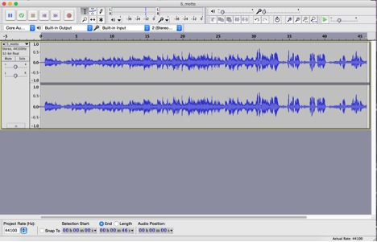
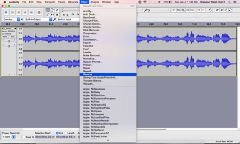
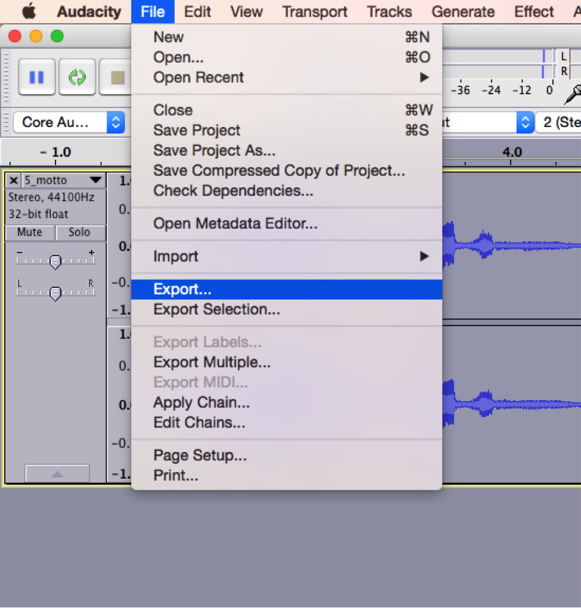

(The following by Brandon Walsh, which is cross-posted from his [personal website](http://bmw9t.github.io/), precedes his upcoming talk at the ACH-sponsored MLA panel “[Digital Deformance and Scholarly Forms](http://www.mla.org/program_details?prog_id=292&year=2015)” on January 9, 2015 in room 212 of the WEST Vancouver Convention Center. Panelists were invited to share their thoughts about methodology in advance of Friday’s panel in efforts to foreground considerations of interpretation over process. If you are unable to attend our upcoming panel, you can follow us on Twitter using the hashtags #mla15 and #s292.)

My talk for the ACH’s panel at MLA 15 is entitled “The Devil in the Recording: Deformative Listening and Poetry.” I will be talking about the problems and affordances for deformance in the context of audio recordings, specifically those that have literary content. The particular method I will focus on is the reversal of audio recordings, taking my cue from the infamous claim that you can hear Satanic lyrics in Led Zeppelin’s “Stairway to Heaven” if you play the recording backwards. In the example below I will show how to reverse an audio file, and I will be working with Langston Hughes’s reading of “Motto” with Charles Mingus and Leonard Feather on his 1958 recording *Weary Blues*.

Professional-grade sound-editing software like [Pro Tools](http://www.avid.com/us/products/family/pro-tools/) or [Logic](https://www.apple.com/logic-pro/) give you the capacity to do a lot in the way of sound mixing and work with music, but I often find myself drowning in their limitless options. They are also quite expensive. [Audacity](http://audacity.sourceforge.net/) is my audio editing software of choice: the tool is open source and, most importantly, fairly intuitive and easy to use. Audacity is somewhat more limited than other options, but it does what it can cleanly and intuitively.

To reverse an audio file, begin by opening that clip in Audacity in the same way that you would open a file in any other piece of software. You will get something that looks like this:

What you see here is a [waveform](http://manual.audacityteam.org/o/man/audacity_waveform.html), a way of graphically representing the audio file in way that allows you to manipulate it. The y-axis of the waveform corresponds to volume – the taller the waveform, the louder the sound file’s contents are at that particular moment in time. This can be a quick and easy way to identify chunks of activity by looking for spikes in the volume.

The x-axis represents time – the Hughes file I have sliced out is 46” long, and the program gives you a timeline along the top of the segment to situate you in the file. Clicking anywhere on the waveform will set the file playback to begin at that point, and you can click and drag to highlight a selection of the clip for processing.

To process the file, highlight the section that you want reversed. In this case, since we are working with the entire file, we will just select everything. Under the “effect” menu, Audacity gives you a range of options for remixing your sound data, but we want the “reverse” function.

Now you have a reversed file at your disposal. Sound tends to work in attack and decay, and much of the strangeness of a reversed recording comes from sounds increasing rather than fading in intensity over time. And, as I will discuss in my talk, the process throws into sharp relief the distinct character of recorded linguistic content.

Audacity saves files in Audacity project formats by default, so you will need to export your file to a different file format if you want to play it in a media player. I tend to use both .ogg and .mp3 files for browser compatibility. Audacity will also give you the opportunity to input light metadata for your file before it exports in case you want to curate your file for inclusion in an archive or home-library.

Audacity gives many other options for experimenting with sound remixing, distortion, and deformance that I would encourage you to explore. The software also gives you many options for working with sound files more generally. I have written [elsewhere](http://bmw9t.github.io/blog/2013/11/13/audio-at-thatcampva/) about using Audacity to prepare sound files for research and presentation. Check out my other post if you want to learn more about how to slice out clips, mix together two sound files, or process DRM files.