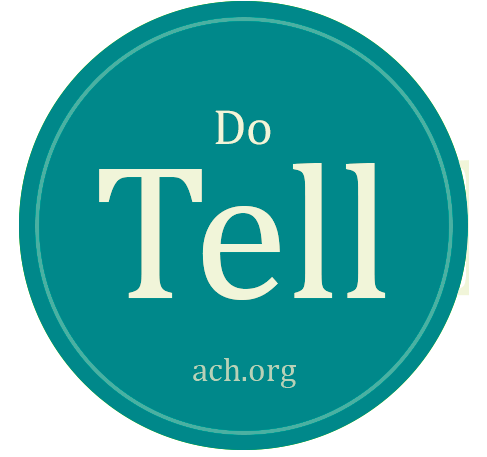

Please Ask/Do Tell stickers are back for DH2018! [Much like at DH2016](http://ach.org/2016/07/11/please-ask-do-tell-at-dh2016/), the Please Ask/Do Tell stickers are designed to be invitations for conversation.

If you have insight into the conference, a particular community of practice within Digital Humanities, a job opportunity to share, mentoring advice, or other information you are willing to share, attach a “Please Ask” sticker to your name badge.

If you have questions about the conference, Digital Humanities, or are seeking information, claim a “Do Tell” sticker for your name badge.

As many of us hold a wide range of information and questions, feel free to grab both.

Finally, an additional gold star sticker is available for those with current job openings to share. All stickers will be available at the registration table and from ACH Exec Members.

The program is designed to create a welcoming atmosphere, allowing those new to the field and those who have something to share opportunities to interact and to share their experience.